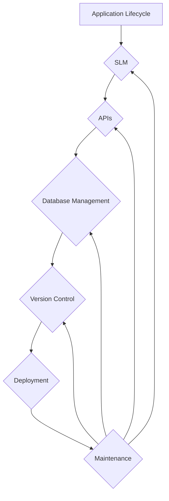

## Application Management Basics

Application management encompasses the entire lifecycle of software applications, from conception to retirement. It involves planning, developing, deploying, monitoring, and maintaining applications to ensure they meet business needs and deliver optimal performance.

### Software Lifecycle Management (SLM)

Software lifecycle management (SLM) is a framework that outlines the stages and activities involved in developing, deploying, and maintaining software applications. It provides a structured approach to ensure that applications are delivered on time, within budget, and meet the required quality standards.

SLM typically includes the following phases:

1. **Planning:** Defining the application's requirements, scope, and objectives.

2. **Design:** Creating the application's architecture, components, and interfaces.

3. **Development:** Implementing the application's functionality and features.

4. **Testing:** Ensuring the application meets requirements, is free of bugs, and performs as expected.

5. **Deployment:** Installing and configuring the application in production environments.

6. **Maintenance:** Monitoring, updating, and supporting the application throughout its lifecycle.

### Understanding APIs (Application Programming Interfaces)

APIs are sets of rules and specifications that define how different software applications can communicate with each other. They act as intermediaries, allowing applications to exchange data and functionality without needing to know the internal details of each other.

APIs provide several benefits, including:

* **Enhanced integration:** APIs enable applications to connect and integrate with each other, sharing data and services seamlessly.

* **Improved agility:** APIs facilitate rapid development and deployment of new applications by leveraging existing functionality.

* **Simplified access:** APIs provide a standardized way to access data and services, making them easier to consume and integrate.

### Database Management

Database management involves creating, maintaining, and accessing data stored in a database. It ensures data integrity, security, and availability to support the operations and decision-making of an organization.

Database management tasks include:

* **Schema design:** Defining the structure and organization of data within the database.

* **Data storage and retrieval:** Storing and retrieving data efficiently and securely.

* **Data integrity:** Maintaining the accuracy and consistency of data within the database.

* **Query optimization:** Optimizing database queries to improve performance and reduce response times.

* **Data security:** Implementing security measures to protect data from unauthorized access, modification, or loss.

### Version Control

Version control is the practice of tracking changes to code and data over time. It allows developers to revert to previous versions if necessary, and it helps to ensure that different developers are working on the same version of code or data.

Version control systems, such as Git, Mercurial, and Subversion, provide a centralized repository for storing and managing different versions of code or data. These systems allow developers to:

* **Track changes:** Record and track changes made to code or data over time.

* **Revert to previous versions:** Restore previous versions of code or data if necessary.

* **Branching and merging:** Create branches to work on different features or bug fixes simultaneously, and merge them back into the main codebase.

* **Collaboration:** Enable multiple developers to work on the same project simultaneously without conflicts.

Version control is an essential tool for software development and data management, ensuring code integrity, collaboration, and the ability to revert to previous versions if needed.

## Graph

