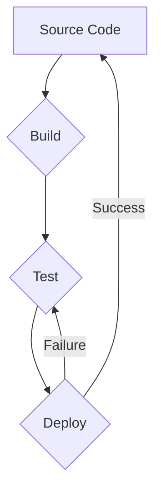

## CI/CD Basics

CI/CD is a software development practice that combines the advantages of continuous integration (CI) and continuous delivery (CD) to automate the software development process. This allows developers to build, test, and deploy software more frequently and reliably.

### Continuous Integration (CI)

Continuous integration is the practice of merging code changes from multiple contributors into a central repository, after which automated builds and tests are run. This helps to identify and fix problems early in the development process, before they become more difficult and expensive to fix.

There are several benefits to using CI, including:

- **Early detection of bugs:** CI helps to identify bugs early in the development process, when they are easier and cheaper to fix.
- **Improved code quality:** CI helps to improve code quality by automatically running tests that check for code errors and security vulnerabilities.
- **Faster feedback:** CI provides developers with faster feedback on their code changes, which helps them to identify and fix problems more quickly.

### Continuous Delivery/Deployment (CD)

Continuous delivery is the practice of automatically deploying code changes to production, or releasing them to users, as soon as they are ready. This helps to shorten the time to market for new features and improvements.

There are several benefits to using CD, including:

- **Faster time to market:** CD helps to shorten the time to market for new features and improvements.
- **Reduced risk of deployment errors:** CD helps to reduce the risk of deployment errors by automating the deployment process.
- **Improved customer satisfaction:** CD helps to improve customer satisfaction by delivering new features and improvements more quickly.

### CI/CD Pipeline

A CI/CD pipeline is a series of automated steps that are used to build, test, and deploy software. The pipeline typically includes the following steps:

2. **Code checkout:** The code is checked out from the central repository.
4. **Build:** The code is built into a deployable artifact, such as a JAR file or a WAR file.
6. **Test:** The code is tested to ensure that it meets quality standards and that it does not contain any bugs.
8. **Deploy:** The code is deployed to production, or released to users.

The CI/CD pipeline can be automated using a variety of tools, such as Jenkins, GitLab CI/CD, and CircleCI.

### Benefits of CI/CD

There are several benefits to using CI/CD, including:

- **Improved quality:** CI/CD helps to improve code quality by identifying and fixing bugs early in the development process.
- **Increased agility:** CI/CD helps to increase agility by allowing developers to build, test, and deploy software more frequently.
- **Reduced costs:** CI/CD helps to reduce costs by automating the software development process.
- **Improved customer satisfaction:** CI/CD helps to improve customer satisfaction by delivering new features and improvements more quickly.

### Conclusion

CI/CD is a powerful tool that can help software development teams to improve the quality, agility, and cost of their software development process. If you are not already using CI/CD, I encourage you to consider adopting it in your organization.

## Graph
