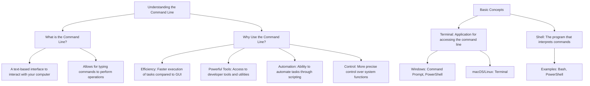

# Understanding the Command Line

## What is the Command Line?
- A text-based interface to interact with your computer.
- Allows for typing commands to perform operations.

## Why Use the Command Line?
- **Efficiency:** Faster execution of tasks compared to GUI.
- **Powerful Tools:** Access to developer tools and utilities.
- **Automation:** Ability to automate tasks through scripting.
- **Control:** More precise control over system functions.

## Basic Concepts

- **Terminal:** Application for accessing the command line.
  - Windows: Command Prompt, PowerShell
  - macOS/Linux: Terminal
- **Shell:** The program that interprets commands.
  - Examples: Bash, PowerShell


## Graph



## Common Commands

```bash
cd [directory] # Change directory
ls # List files (macOS/Linux)
dir # List files (Windows)
mkdir [directory] # Create new directory
rm [file] # Delete a file
touch [file] # Create new file
cp [source] [destination] # Copy files/directories
mv [source] [destination] # Move/rename files/directories
```
The End
