## Tech Stack Basics

Creating a comprehensive table of all possible tech stack configurations for APIs is challenging due to the vast number of technologies and their combinations. However, we can provide a simplified table that covers major categories and some common technologies within them. This should give you a general idea of the different components involved in creating, distributing, and maintaining APIs.

| Category              | Technology/Tool Examples                                  |
|-----------------------|-----------------------------------------------------------|
| **Programming Languages**  | Python, JavaScript (Node.js), Java, C#, Go, Ruby         |
| **API Frameworks**         | Express (Node.js), Django (Python), Spring Boot (Java), Flask (Python), FastAPI (Python) |
| **API Specification**      | OpenAPI/Swagger, RAML, API Blueprint                     |
| **Database**               | MySQL, PostgreSQL, MongoDB, Oracle, SQL Server           |
| **API Gateway**            | Kong, Apigee, AWS API Gateway, Azure API Management      |
| **Authentication**         | OAuth 2.0, JWT, Basic Auth, OpenID Connect               |
| **Web Servers**            | Nginx, Apache, IIS                                       |
| **Load Balancer**          | HAProxy, AWS ELB, Nginx                                  |
| **Containerization**       | Docker, Kubernetes, OpenShift                            |
| **Serverless Platforms**   | AWS Lambda, Azure Functions, Google Cloud Functions      |
| **API Testing Tools**      | Postman, SoapUI, JMeter, Swagger UI                      |
| **CI/CD Tools**            | Jenkins, GitLab CI, CircleCI, Travis CI, GitHub Actions  |
| **Monitoring & Logging**   | Grafana, Prometheus, ELK Stack, Datadog, New Relic       |
| **API Documentation**      | SwaggerUI, Redoc, Slate                                  |
| **Cloud Providers**        | AWS, Azure, Google Cloud, IBM Cloud                      |
| **CDN**                    | Cloudflare, Akamai, AWS CloudFront                       |
| **Caching**                | Redis, Memcached, Varnish                                |

This table includes a variety of tools and technologies that are commonly used at different stages of API development and maintenance. The choices depend on the specific requirements, scale, and preferences of your project. It's common for developers and companies to mix and match these technologies to suit their needs.

```mermaid
graph TD
    Team --> ProgrammingLanguages
    Team --> APIFrameworks
    Team --> APISpecification
    Team --> Database
    Team --> APIGateway
    Team --> Authentication
    Team --> WebServers
    Team --> LoadBalancer
    Team --> Containerization
    Team --> ServerlessPlatforms
    Team --> APITestingTools
    Team --> CICDTools
    Team --> MonitoringLogging
    Team --> APIDocumentation
    Team --> CloudProviders
    Team --> CDN
    Team --> Caching

    ProgrammingLanguages --> PL[Python, JS, Java, C#, Go, Ruby]
    APIFrameworks --> AF[Express, Django, Spring Boot, Flask, FastAPI]
    APISpecification --> APS[OpenAPI, RAML, API Blueprint]
    Database --> DB[MySQL, PostgreSQL, MongoDB, Oracle, SQL Server]
    APIGateway --> AG[Kong, Apigee, AWS API Gateway]
    Authentication --> Auth[OAuth 2.0, JWT, Basic Auth]
    WebServers --> WS[Nginx, Apache, IIS]
    LoadBalancer --> LB[HAProxy, AWS ELB, Nginx]
    Containerization --> CT[Docker, Kubernetes, OpenShift]
    ServerlessPlatforms --> SP[AWS Lambda, Azure Functions, GCP Functions]
    APITestingTools --> ATT[Postman, SoapUI, JMeter]
    CICDTools --> CI[ Jenkins, GitLab CI, CircleCI]
    MonitoringLogging --> ML[Grafana, Prometheus, ELK Stack]
    APIDocumentation --> AD[SwaggerUI, Redoc, Slate]
    CloudProviders --> CP[AWS, Azure, Google Cloud, IBM Cloud]
    CDN --> CDNTools[Cloudflare, Akamai, AWS CloudFront]
    Caching --> Cache[Redis, Memcached, Varnish]
```

