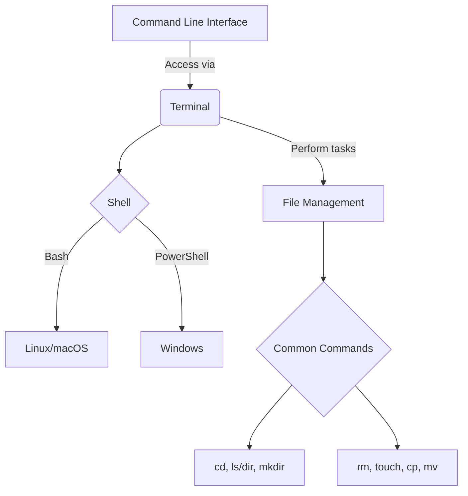

## Git Basics

Learning about Git is a valuable skill, especially in a software development environment like a startup. Git is a version control system, which is essential for managing changes to your codebase over time. Here's a basic overview:

1. **What is Git?**
   - Git is a distributed version control system. It helps you track changes in your code over time, allowing multiple people to work on the same project without conflicting with each other's changes.

2. **Key Concepts:**
   - **Repository (Repo):** This is where your project's files and their history are stored.
   - **Commit:** A commit is like a snapshot of your project at a particular point in time. It contains the changes you made along with a message describing what you did.
   - **Branch:** A branch in Git is like a separate line of development. You can have a main branch (often called 'master' or 'main') and other branches for developing features or fixing bugs.
   - **Merge:** When you're done working in a branch, you merge those changes back into the main branch, combining different branches' histories.

3. **Basic Commands:**
   - `git init`: Initializes a new Git repository.
   - `git clone [url]`: Creates a local copy of a remote repository.
   - `git add [file]`: Stages a file for commit.
   - `git commit -m "[commit message]"`: Commits your staged files with a message describing the changes.
   - `git push`: Uploads your commits to a remote repository.
   - `git pull`: Updates your local repository to the newest commit from the remote repository.
   - `git branch [branch-name]`: Creates a new branch.
   - `git checkout [branch-name]`: Switches to another branch.
   - `git merge [branch]`: Merges a different branch into your current branch.

4. **Best Practices:**
   - Make small, frequent commits: This makes it easier to track changes and find bugs.
   - Write clear commit messages: Describe what you changed and why.
   - Use branches for new features or bug fixes: This keeps your main codebase stable.

5. **Common Workflows:**
   - **Feature Branch Workflow:** Develop new features in separate branches, then merge them into the main branch once they're ready.
   - **Forking Workflow:** Often used in open-source projects, where you fork (create a personal copy of) a repository, make changes, and then propose those changes to the original repository through a pull request.

## Graph

## In Summary
Remember, Git can be complex at first, but with practice, it becomes an invaluable tool in managing your code. Don't hesitate to experiment and explore its features in a test repository. Are there specific aspects of Git you're interested in, or do you have any specific questions?