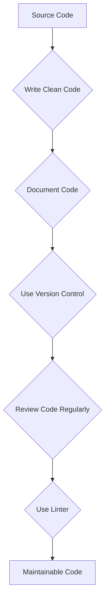

## Source Code Basics

Source code is the fundamental building block of software. It's the human-readable instructions that tell a computer what to do. Source code is written in a programming language, such as Python, Java, or C++, and it can be stored in a variety of formats, such as plain text, XML, or JSON.

Source code management (SCM) is the practice of managing and controlling changes to code throughout the software development lifecycle. This includes storing code in a central repository, tracking changes, and providing a way for developers to collaborate on code. SCM systems help to ensure that code is consistent, reliable, and easy to maintain.

[Image of Git repository]

There are many different SCM systems available, but some of the most popular include Git, Mercurial, and Subversion. Each system has its own strengths and weaknesses, so it's important to choose the right one for your needs.

Here are some of the benefits of using SCM:

* **Improved code quality:** SCM helps to improve code quality by providing a way to track changes and revert to previous versions if necessary.
* **Increased collaboration:** SCM helps developers to collaborate on code by providing a central repository and a way to merge changes.
* **Reduced risk of errors:** SCM helps to reduce the risk of errors by providing a way to track changes and identify conflicts.

### Best Practices for Source Code Management

In addition to using an SCM system, there are a number of best practices that developers can follow to improve the quality and maintainability of their code. Some of these best practices include:

* **Write clean, consistent code:** Code should be easy to read and understand, and it should follow consistent coding conventions.
* **Document your code:** Code comments can help other developers to understand your code and how it works.
* **Use version control:** Version control systems allow you to track changes to your code and revert to previous versions if necessary.
* **Review your code regularly:** Code reviews can help to identify and fix bugs before they are deployed to production.
* **Use a linter:** A linter is a tool that can check your code for syntax errors and other coding issues.

By following these best practices, developers can help to ensure that their code is high-quality, maintainable, and bug-free.

## Graph

This diagram illustrates the process of transforming source code into maintainable code by following the best practices outlined above.